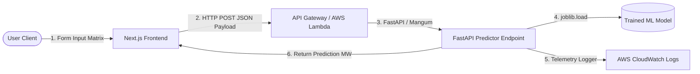

# ⚡ PJME Grid Load Forecasting Service (Frontend Client)

An AWS Hosted web application and user interface designed to interact with a serverless machine learning inference backend to forecast PJM East (PJME) electrical grid load.

Built with **Next.js 16 (App Router)**, **React 19**, **Tailwind CSS v4**, and **TypeScript**, this dashboard maps real-time user-input telemetry parameters to a decoupled FastAPI-based serverless endpoint.

---

## 🚀 Key Features

- **Decoupled Telemetry Transmission:** Connects dynamically with an AWS Lambda backend using HTTP POST payloads.
- **Strict Parameter Schema Mapping:** Exposes input fields mapped precisely to the model feature matrix.
- **Real-time Inference Output Display:** Instantly computes and displays estimated demand in **Megawatts (MW)** with status handlers for computing/loading states and network errors.
- **Responsive Premium Theme:** Styled with a dark-mode palette, using emerald-400 highlights for modern grid-monitoring aesthetics.

---

## 🛠️ Architecture Overview

The interface serves as the frontend layer of a dual-tier serverless forecasting system:



---

## ⚙️ Environment Configuration

Before running the frontend, configure the backend API URL. Define a `.env.local` file in the root of the `pjme-energy-frontend` directory:

```env
NEXT_PUBLIC_API_URL=http://127.0.0.1:8000
```

*Note: In production (e.g., hosted on AWS Amplify), ensure this variable matches the live API Gateway endpoint.*

---

## 📦 Getting Started

### Prerequisites

- **Node.js** (v18.x or later recommended)
- **npm**, **yarn**, **pnpm**, or **bun**

### Installation

1. Navigate to the frontend directory:
   ```bash
   cd pjme-energy-frontend
   ```

2. Install dependencies:
   ```bash
   npm install
   ```

3. Run the development server:
   ```bash
   npm run dev
   ```

4. Open [http://localhost:3000](http://localhost:3000) in your browser to view the application.

---

## 📋 Input Metric Matrix

The forecasting form expects the following parameters which are passed directly to the XGBoost/Scikit-Learn backend:

### Temporal Metadata
* **Hour:** Hour of the day (0–23)
* **Day of Week:** Day index (0 = Monday, 6 = Sunday)
* **Quarter:** Annual quarter (1–4)
* **Month:** Calendar month (1–12)
* **Year:** Calendar year (e.g., `2016`)
* **Day of Year:** Day number of the year (1–366)
* **Is Weekend:** `1` if the day is a Saturday or Sunday, else `0`

### Pipeline Telemetry & Lag Features
* **Lag 1 Hour:** Energy consumption exactly 1 hour prior (in KWH / MW equivalent)
* **Lag 24 Hours:** Energy consumption 24 hours prior (in KWH / MW equivalent)
* **Lag 7 Days:** Energy consumption 7 days prior (in KWH / MW equivalent)
* **Rolling Mean 24h:** Average energy consumption over the last 24 hours
* **Rolling Mean 7d:** Average energy consumption over the last 7 days

---

## 📦 Scripts

- `npm run dev` - Starts the development server with hot-reloading.
- `npm run build` - Creates an optimized production build of the Next.js application.
- `npm run start` - Runs the built Next.js application in production mode.
- `npm run lint` - Performs ESLint checks to ensure code quality.
