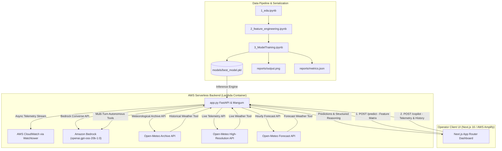
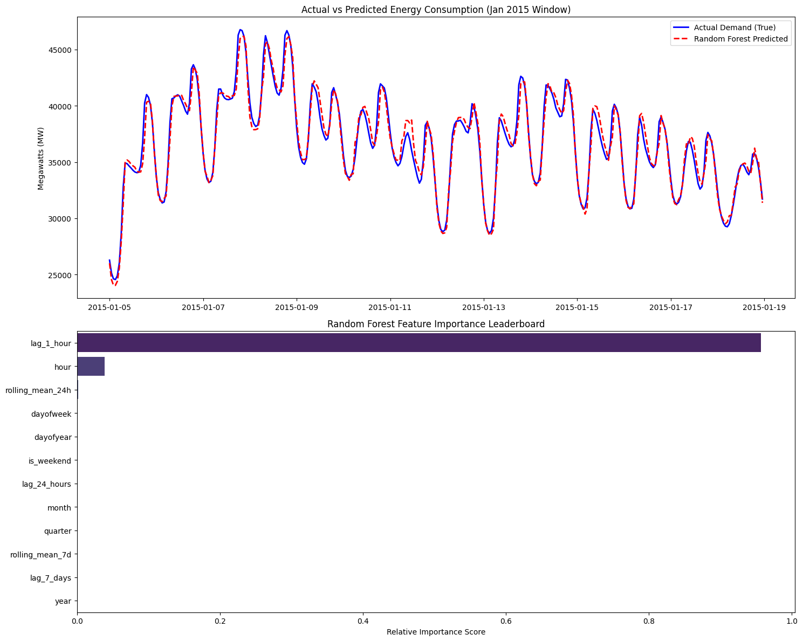

# ⚡ PJME Grid Demand Forecasting & Autonomous AI Grid Agent

[](https://www.python.org/)
[](https://fastapi.tiangolo.com/)
[](https://aws.amazon.com/lambda/)
[](https://aws.amazon.com/bedrock/)
[-000000.svg?logo=next.js)](https://nextjs.org/)
[](https://aws.amazon.com/cloudwatch/)
[](https://docs.pytest.org/)

A production-grade, decoupled serverless application designed to forecast **PJM East (PJME)** electrical grid load and provide autonomous, context-aware operational intelligence.

The platform integrates a high-precision **Scikit-Learn Random Forest Regressor** ($R^2 = 0.99$), an autonomous **Amazon Bedrock AI Grid Agent** with real-time and historical meteorological tool execution, **AWS CloudWatch** telemetry logging, and a modern **Next.js 16** operator interface deployed via **AWS Amplify** and **AWS Lambda**.

---

## 🏗️ System Architecture

The application decouples the machine learning data pipeline, cloud serverless microservices, and client presentation tier:


```mermaid
graph TB
    subgraph Pipeline["Data Pipeline & Serialization"]
        EDA["1_eda.ipynb"] --> FE["2_feature_engineering.ipynb"]
        FE --> MT["3_ModelTraining.ipynb"]
        MT --> Model[("models/best_model.pkl")]
        MT --> RepFig["reports/output.png"]
        MT --> RepMet["reports/metrics.json"]
    end

    subgraph Backend["AWS Serverless Backend (Lambda Container)"]
        API["app.py FastAPI & Mangum"]
        Model -->|Inference Engine| API
        API -->|Async Telemetry Stream| CW["AWS CloudWatch via Watchtower"]
        API -->|Bedrock Converse API| Bedrock["Amazon Bedrock (openai.gpt-oss-20b-1:0)"]
        API -->|Meteorological Archive API| HistWeather["Open-Meteo Archive API"]
        API -->|Live Telemetry API| LiveWeather["Open-Meteo High-Resolution API"]
        API -->|Hourly Forecast API| ForeWeather["Open-Meteo Forecast API"]
        HistWeather -->|Historical Weather Tool| API
        LiveWeather -->|Live Weather Tool| API
        ForeWeather -->|Forecast Weather Tool| API
        Bedrock <-->|Multi-Turn Autonomous Tools| API
    end

    subgraph Client["Operator Client UI (Next.js 16 / AWS Amplify)"]
        FE_UI["Next.js App Router Dashboard"]
        FE_UI -->|1. POST /predict - Feature Matrix| API
        FE_UI -->|2. POST /copilot - Telemetry & History| API
        API -->|Predictions & Structured Reasoning| FE_UI
    end
```

---

## 📊 Machine Learning Pipeline & Evaluation

The forecasting engine predicts hourly regional electrical load (in Megawatts) using temporal dynamics, lag indicators, and statistical moving averages.

### 1. Feature Engineering Matrix
* **Temporal Attributes (7)**: `hour` (0–23), `dayofweek` (0–6), `quarter` (1–4), `month` (1–12), `year` (YYYY), `dayofyear` (1–366), `is_weekend` (0 or 1).
* **Lag Telemetry (3)**: `lag_1_hour`, `lag_24_hours`, `lag_7_days` (Historical load at key operational offsets).
* **Statistical Indicators (2)**: `rolling_mean_24h`, `rolling_mean_7d` (Smoothed moving averages capturing macro trends).

### 2. Model Performance Benchmarks
Evaluated on an out-of-sample test partition from the PJM East regional transmission dataset:

| Metric | Score | Operational Significance |
| :--- | :---: | :--- |
| **MAE** (Mean Absolute Error) | **467.70 MW** | Average deviation across all operating hours |
| **RMSE** (Root Mean Squared Error) | **636.33 MW** | Penalizes severe forecast errors during peak hours |
| **MAPE** (Mean Absolute Percentage Error) | **1.47%** | Near human parity demand accuracy across seasons |
| **$R^2$ Score** (Coefficient of Determination) | **0.99** | Model captures 99% of total grid load variance |

### 3. Model Evaluation Figure & Feature Importance
The figure below illustrates out-of-sample predictions vs. true demand across a two-week January window, alongside the feature importance leaderboard:



* **Waveform Fidelity**: The top panel demonstrates tight alignment between true load (solid blue) and model forecasts (dashed red) across both baseline valleys (~25,000 MW) and extreme heating surge peaks (>47,000 MW).
* **Feature Importance Hierarchy**: The bottom panel confirms strong auto-regressive dependency:
  - `lag_1_hour` represents ~95% of relative feature importance.
  - `hour` accounts for ~4%, reflecting diurnal human consumption patterns.
  - Rolling trends and calendar vectors provide subtle regularizing signals during regime shifts.

---

## ⚡ Autonomous AI Grid Agent (Amazon Bedrock)

The application embeds an autonomous grid operator copilot powered by **Amazon Bedrock Converse API** utilizing `openai.gpt-oss-20b-1:0`.

`	ext
Operator Prompt ──> POST /copilot ──> Bedrock Converse Loop
                                            │
         ┌──────────────────────────────────┼──────────────────────────────────┐
         ▼                                  ▼                                  ▼
Tool: get_live_weather(lat, lon)   Tool: get_forecast_weather(date, h)  Tool: get_historical_weather(y, m, doy, h)
Fetches real-time PJM East data    Queries forward hourly forecast      Parses exact column date & archive
         │                                  │                                  │
         └──────────────────────────────────┴──────────────────────────────────┘
                                            ▼
                        Structured Multi-Turn JSON Synthesis
                        - Thermal regime analysis (Heating/Cooling surge)
                        - Markdown telemetry tables
                        - Mandatory Actionable Operational Recommendations
`

### Autonomous Meteorological Tools
1. **`get_live_weather(lat, lon)`**:
   - Queries Open-Meteo High-Resolution API for current temperature, apparent temperature, relative humidity, and wind speed for regional grid coordinates (Philadelphia, PA: $39.95^\circ\text{N}, -75.16^\circ\text{W}$).
2. **`get_forecast_weather(date_str, hour, days, lat, lon)` (Forecast Tool)**:
   - Queries Open-Meteo High-Resolution Forecast API for forward-looking hourly meteorological forecasts (up to 16 days ahead), computing projected temperatures, apparent temperatures, relative humidity, precipitation probability, and daily min/max bounds for proactive day-ahead dispatch planning.
3. **`get_historical_weather(year, month, dayofyear, hour, ...)`**:
   - Dynamically derives the historical calendar date directly from active dashboard input columns and retrieves historical meteorological archive data to explain baseline load anomalies.

### Multi-Turn Agent Features
* **Telemetry Anchoring**: Injects the active forecast prediction, lag metrics, and temporal vectors into every turn, ensuring responses are mathematically grounded.
* **Collapsible Tool Inspection**: UI provides interactive `🛠️ Tool Calls` badges displaying execution arguments and returned telemetry payloads.
* **Mandatory Dispatch Conclusions**: Enforces concrete operational recommendations (curtailment, spinning reserve activation, or peaking unit ramp-up).

---

## 🖥️ Modern Operator Interface (Next.js 16)

The web dashboard is built with Next.js 16 (App Router), React, and Vanilla CSS/Tailwind design tokens:

* **Quick Sample Auto-Generators**:
  - `⚡ Today (Now)`: Auto-populates current calendar features without overwriting historical lag indicators.
  - `🏛️ 2016 Benchmark`: Restores the historical reference case (Jan 4, 2016, 18:00).
* **Interactive Calendar Resolver**:
  - `<input type="date">` with real-time automatic derivation of `dayofweek`, `quarter`, `month`, `year`, `dayofyear`, and `is_weekend`.
* **Strict Validation & Error Surfacing**:
  - Validates constraints (e.g. `Hour: enter between 0 and 23`, `Month: enter between 1 and 12`).
  - Prominently displays formatted field-level errors directly inside the **Inference Output** panel.
* **Synchronous Grid Agent Interface**:
  - Standard JSON communication with quick action suggestion pills, GFM markdown rendering, and tool invocation tracking.

---

## 📡 API Specification

### `GET /`
Service health and model availability check.
```json
{
  "service": "PJME Grid Load Forecasting Service",
  "status": "healthy",
  "model_loaded": true,
  "region": "ap-south-1"
}
```

### `POST /predict`
Executes ML model inference against the feature vector.
```json
// Request Payload
{
  "hour": 18,
  "dayofweek": 0,
  "quarter": 1,
  "month": 1,
  "year": 2016,
  "dayofyear": 4,
  "is_weekend": 0,
  "lag_1_hour": 31200.0,
  "lag_24_hours": 29800.0,
  "lag_7_days": 32100.0,
  "rolling_mean_24h": 30500.0,
  "rolling_mean_7d": 31000.0
}

// Response
{
  "prediction_mw": 31466.16,
  "status": "success"
}
```

### `POST /copilot`
Dispatches conversational reasoning and autonomous tool execution to Amazon Bedrock.
```json
// Request Payload
{
  "chat_history": [{"role": "user", "text": "Assess current demand and weather impact."}],
  "current_prediction": 31466.16,
  "hour": 18,
  "dayofweek": 0,
  "quarter": 1,
  "month": 1,
  "year": 2016,
  "dayofyear": 4,
  "is_weekend": 0,
  "lag_1_hour": 31200.0,
  "lag_24_hours": 29800.0,
  "lag_7_days": 32100.0,
  "rolling_mean_24h": 30500.0,
  "rolling_mean_7d": 31000.0
}

// Response
{
  "status": "success",
  "response": "### Operational Assessment\n...",
  "tool_calls": [
    {
      "name": "get_historical_weather",
      "input": {"year": 2016, "month": 1, "dayofyear": 4, "hour": 18},
      "output": {"temperature_fahrenheit": 33.8, "thermal_regime": "Cold Space-Heating Demand"}
    }
  ]
}
```

### `GET /weather/forecast`
Fetches forward-looking hourly meteorological forecast telemetry from Open-Meteo High-Resolution Forecast API (up to 16 days ahead).
* **Query Parameters**:
  - `date_str`: Target date in `YYYY-MM-DD` format (defaults to tomorrow if omitted).
  - `hour`: Operating hour index `0` to `23` (default: `12`).
  - `days`: Forecast horizon span in days `1` to `16` (default: `1`).
  - `lat`, `lon`: Regional coordinates (defaults to Philadelphia / PJM East: `39.95`, `-75.16`).

---

## 📂 Project Directory Structure

```text
├── .github/workflows/
│   └── deploy.yml              # CI/CD: Automated pytest, Docker build, ECR push, Lambda deploy
├── aws/
│   ├── bedrock_policy.json     # Principle of least privilege IAM policy for Bedrock
│   └── s3_setup.md             # S3 bucket configuration notes
├── datasets/
│   └── PJME_hourly.csv         # PJM East regional transmission raw time-series dataset
├── models/
│   └── best_model.pkl          # Serialized Scikit-Learn Random Forest model
├── pjme-energy-frontend/       # Operator UI (Next.js 16 + React)
│   ├── src/app/components/
│   │   └── EnergyCopilot.tsx   # Grid Agent chat interface & tool invocation viewer
│   ├── src/app/page.tsx        # Dashboard layout, calendar resolver & sample presets
│   ├── .env.local              # Client environment variables (NEXT_PUBLIC_API_URL)
│   └── package.json            # Node.js dependencies
├── reports/
│   ├── metrics.json            # Machine learning test partition evaluation scores
│   └── output.png              # Actual vs. Predicted curves & Feature Importance chart
├── src/
│   ├── main.py                 # Local development FastAPI ASGI application
│   └── schemas.py              # Pydantic data schemas
├── tests/
│   └── test_api.py             # Pytest test suite (prediction, tools, copilot mocks)
├── 1_eda.ipynb                 # Exploratory data analysis notebook
├── 2_feature_engineering.ipynb # Feature creation & lag analysis notebook
├── 3_ModelTraining.ipynb       # Model hyperparameter tuning & evaluation notebook
├── amplify.yml                 # AWS Amplify build & deployment configuration
├── app.py                      # Production serverless entry point (FastAPI + Bedrock + CloudWatch)
├── Dockerfile                  # Production AWS Lambda container definition
├── pyproject.toml              # Python package metadata & dependencies
└── README.md                   # Comprehensive system documentation
```

---

## 🛠️ Local Setup & Testing

### 1. Backend Service
Ensure Python 3.12+ is installed:
```bash
# Create and activate virtual environment
python -m venv .venv
.venv\Scripts\activate       # On Windows
# source .venv/bin/activate  # On Linux/macOS

# Install dependencies
pip install -r requirements.txt
pip install pytest httpx

# Run test suite
pytest tests/

# Start local server
fastapi dev app.py
```

### 2. Frontend Dashboard
```bash
cd pjme-energy-frontend

# Install dependencies
npm install

# Start development server
npm run dev
```
Open [http://localhost:3000](http://localhost:3000) to view the application.

---

## 🚀 CI/CD & Cloud Deployment

### 1. Automated GitHub Actions Workflow (`.github/workflows/deploy.yml`)
1. **Automated Testing**: Runs `pytest tests/` on Python 3.12 with Bedrock calls safely mocked.
2. **Container Build & Tag**: Builds multi-stage production Docker image targeting Amazon Linux 2023.
3. **ECR Push**: Authenticates and pushes tagged images to Amazon ECR (`pjme-energy-api`).
4. **Lambda Deployment**: Updates `PJME_Inference_Engine` code and ensures execution timeout is configured for Bedrock inference.

### 2. AWS Amplify
The frontend dashboard is continuously deployed via AWS Amplify using `amplify.yml`. Every commit to `main` automatically triggers an optimized Next.js static and SSR build.

---

## 🛡️ License

This project is licensed under the MIT License. Developed for intelligent power grid operational planning and regional energy load forecasting.
