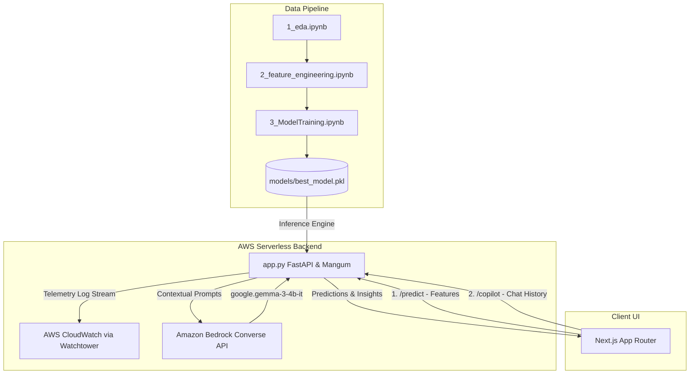

# ⚡ PJME Grid Demand Forecasting & AWS AI Co-Pilot

A production-grade, decoupled serverless application designed to forecast PJM East (PJME) electrical grid load and provide intelligent grid operational insights. 

The system leverages a **Scikit-Learn Random Forest model** for energy demand forecasting, integrates with **Amazon Bedrock** for a context-aware grid AI Co-Pilot, logs telemetry to **AWS CloudWatch**, and is deployed serverless on **AWS Lambda** (backend) and **Next.js** (frontend client).

---

## 🏗️ System Architecture

The application is split into a machine learning data pipeline, a serverless API backend, and a modern frontend dashboard.


```mermaid
graph TB
    subgraph Data Pipeline
        EDA[1_eda.ipynb] --> FE[2_feature_engineering.ipynb]
        FE --> MT[3_ModelTraining.ipynb]
        MT --> Model[(models/best_model.pkl)]
    end

    subgraph AWS Serverless Backend
        API[app.py FastAPI & Mangum]
        Model -->|Inference Engine| API
        API -->|Telemetry Log Stream| CW[AWS CloudWatch via Watchtower]
        API -->|Contextual Prompts| Bedrock[Amazon Bedrock Converse API]
        Bedrock -->|google.gemma-3-4b-it| API
    end

    subgraph Client UI
        FE_UI[Next.js App Router]
        FE_UI -->|1. /predict - Features| API
        FE_UI -->|2. /copilot - Chat History| API
        API -->|Predictions & Insights| FE_UI
    end
```

---

## 🚀 AWS Integration Stack

This project leverages a modern AWS cloud architecture to deliver scalable, secure, and smart services:

### 1. AWS Lambda & Mangum (Serverless Backend)
The backend is powered by **FastAPI** and packaged as a Docker container deployed to **AWS Lambda**. The **Mangum** adapter acts as the ASGI handler, translating API Gateway requests to FastAPI and back, ensuring zero-cold-start performance optimization.

### 2. Amazon Bedrock Converse API (AI Grid Co-Pilot)
The backend integrates with the **Amazon Bedrock Converse API** using `google.gemma-3-4b-it` to power a context-aware **AI Grid Co-Pilot**.
* **Continuous Conversations**: The frontend sends the entire React message state `chat_history` to the backend. The backend dynamically reformats it for the Bedrock Converse API.
* **Telemetry Context Ingestion**: For every request, the current grid telemetry vector (ML Forecast, lag values, rolling means, and temporal attributes) is dynamically injected into the system prompt, allowing the LLM to make highly accurate, numbers-driven operational statements.
* **Format Constraints**: Automatically cleans and handles welcome messages to adhere to Bedrock's requirement that chat history begins and ends with `user` messages.

### 3. AWS CloudWatch & Watchtower (Telemetry & Logging)
All prediction outcomes, model performance, and runtime errors are pushed asynchronously to AWS CloudWatch using `watchtower` log handlers:
* Log Group: `PJME_Inference_Pipeline`
* Log Stream: `Serverless_Lambda_Logs`
* Pushes runtime telemetry such as `LAMBDA_INFERENCE_SUCCESS | Predicted_Load: 31466.16 MW` directly for real-time observability.

---

## 📋 Data Science & ML Pipeline

The forecasting pipeline is documented inside three core Jupyter notebooks in the root directory:
1. **[1_eda.ipynb](file:///c:/Akhil/AI_Engineer/1stProject/1_eda.ipynb)**: Exploratory Data Analysis of the PJME hourly time-series dataset.
2. **[2_feature_engineering.ipynb](file:///c:/Akhil/AI_Engineer/1stProject/2_feature_engineering.ipynb)**: Development of temporal features, rolling means, and lag metrics.
3. **[3_ModelTraining.ipynb](file:///c:/Akhil/AI_Engineer/1stProject/3_ModelTraining.ipynb)**: Training, evaluation, and serialization of the Random Forest model to `models/best_model.pkl`.

### Feature Matrix Schema
Predictions expect the following parameter mapping:
* **Temporal Vectors**: `hour` (0-23), `dayofweek` (0-6), `quarter` (1-4), `month` (1-12), `year` (YYYY), `dayofyear` (1-366), `is_weekend` (0 or 1).
* **Lag Telemetry**: `lag_1_hour`, `lag_24_hours`, `lag_7_days` (Historical KWH/MW loads).
* **Statistical Indicators**: `rolling_mean_24h`, `rolling_mean_7d` (Moving averages).

---

## 📂 Project Directory Structure

```text
├── .venv/                      # Python local virtual environment
├── aws/                        # Cloud setup markdown scripts
├── datasets/                   # Raw & processed PJME CSV files
├── models/                     # Best serialized model (best_model.pkl)
├── processed/                  # Cached engineering matrices
├── src/                        # FastAPI helper schemas & main entry points
├── tests/                      # Pytest API validation files
├── pjme-energy-frontend/       # Next.js Client Dashboard
│   ├── src/app/components/     # EnergyCopilot.tsx chat interface
│   ├── src/app/page.tsx        # Dashboard Main Grid UI layout
│   └── .env.local              # Local client environment configurations
├── app.py                      # Production FastAPI endpoint & Bedrock connector
├── Dockerfile                  # Container definition for AWS Lambda deployment
├── pyproject.toml              # Python dependencies & metadata
└── README.md                   # Project developer documentation (this file)
```

---

## ⚙️ Local Development Setup

### Backend Setup
1. Verify Python version is 3.12+ (managed in `.python-version`).
2. Install virtual environment dependencies:
   ```bash
   pip install -r requirements.txt
   ```
3. Run the backend local server:
   ```bash
   fastapi dev app.py
   ```
   *Note: Ensure your local environment is authenticated with AWS CLI (`aws configure`) in the correct region (`ap-south-1`) to enable Bedrock and CloudWatch logs.*

### Frontend Setup
1. Navigate to the frontend directory:
   ```bash
   cd pjme-energy-frontend
   ```
2. Create `.env.local`:
   ```env
   NEXT_PUBLIC_API_URL=http://localhost:8000
   ```
3. Install packages and start the server:
   ```bash
   npm install
   npm run dev
   ```
4. Access the dashboard at `http://localhost:3000`.

---

## 📦 Containerization & AWS Deployment

The backend API is containerized using the `Dockerfile` to target AWS Lambda.

### 1. Build and Tag Docker Image
Retrieve the ECR login token and build the image:
```bash
aws ecr get-login-password --region ap-south-1 | docker login --username AWS --password-stdin 138071776345.dkr.ecr.ap-south-1.amazonaws.com

docker build -t pjme-energy-api .
docker tag pjme-energy-api:latest 138071776345.dkr.ecr.ap-south-1.amazonaws.com/pjme-energy-api:latest
```

### 2. Push Image to Amazon ECR
```bash
docker push 138071776345.dkr.ecr.ap-south-1.amazonaws.com/pjme-energy-api:latest
```

### 3. Deploy to AWS Lambda
Update the Lambda function code to use the newly pushed ECR image:
```bash
aws lambda update-function-code --function-name PJME_Energy_Forecast_API --image-uri 138071776345.dkr.ecr.ap-south-1.amazonaws.com/pjme-energy-api:latest
```
